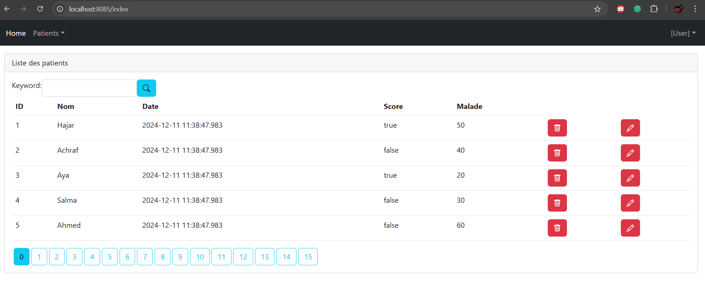
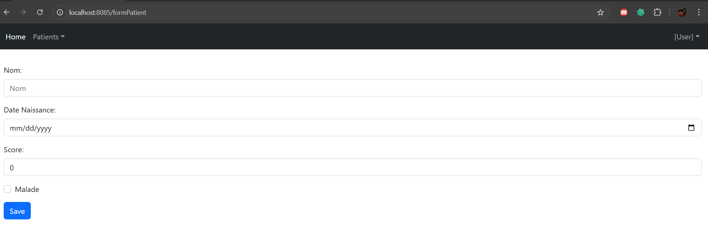

# Unsecured Hospital Management Application

## Overview
The **Unsecured Hospital Management Application** is a basic Java Spring Boot web application designed to manage patients' information. It allows users to:
- List patients with pagination.
- Search patients by name.
- Add, edit, and delete patient records.

The application is developed using the following technologies:

- **Backend**: Spring Boot, JPA (Hibernate), Java 17
- **Frontend**: Thymeleaf, Bootstrap
- **Database**: H2 (in-memory database)
- **Build Tool**: Maven

---

## Features

1. **Patient Management**
    - View the list of patients.
    - Add new patients.
    - Edit patient details.
    - Delete a patient record.

2. **Search and Pagination**
    - Search patients by keyword.
    - Navigate through patient records using pagination.

3. **Real-Time View Updates**
    - Automatically updates the table when new records are added or deleted.

---

## Project Structure

```
├── src
│   ├── main
│   │   ├── java
│   │   │   └── net.yassine.hospitalapp
│   │   │       ├── entities
│   │   │       │   └── Patient.java
│   │   │       ├── repository
│   │   │       │   └── PatientRepository.java
│   │   │       ├── web
│   │   │       │   └── PatientController.java
│   │   │       └── UnsecuredHospitalAppSpringBoot.java
│   │   └── resources
│   │       ├── templates
│   │       │   ├── patients.html
│   │       │   ├── formPatient.html
│   │       │   ├── editPatient.html
│   │       └── application.properties
├── pom.xml
└── README.md
```

---

## Setup Instructions

### Prerequisites
Ensure you have the following installed:
- **Java**: JDK 17 or later
- **Maven**: Version 3.6 or later
- **IDE**: IntelliJ IDEA, Eclipse, or any Java IDE

### Steps to Run
1. Clone the repository:
   ```bash
   git clone https://github.com/yassineab53/UnsecuredHospitalApp-SpringBoot
   cd unsecured-hospital-app
   ```
2. Build the project:
   ```bash
   mvn clean install
   ```
3. Run the application:
   ```bash
   mvn spring-boot:run
   ```
4. Open the application in your browser:
   ```
   http://localhost:8085/index
   ```

---

## Screenshots

### 1. List of Patients



### 2. Add a Patient




## Database Configuration
The application uses an H2 in-memory database. The configuration can be found in the `application.properties` file:

```properties
spring.datasource.url=jdbc:h2:mem:testdb
spring.datasource.driverClassName=org.h2.Driver
spring.datasource.username=sa
spring.datasource.password=
spring.h2.console.enabled=true
spring.jpa.database-platform=org.hibernate.dialect.H2Dialect
```

Access the H2 database console at:
```
http://localhost:8085/h2-console
```
Default credentials:
- **Username**: `sa`
- **Password**: (leave blank)

---

## Future Improvements

- **Security**: Add Spring Security to secure endpoints and sensitive data.
- **Advanced Features**: Implement role-based access control (e.g., admin vs user functionality).
- **Database Integration**: Replace H2 with a production-ready database like MySQL.
- **Testing**: Add unit and integration tests using JUnit and Mockito.

---

## Author
**Abbou Yassine** : yassine.abbou.23@ump.ac.ma
--
