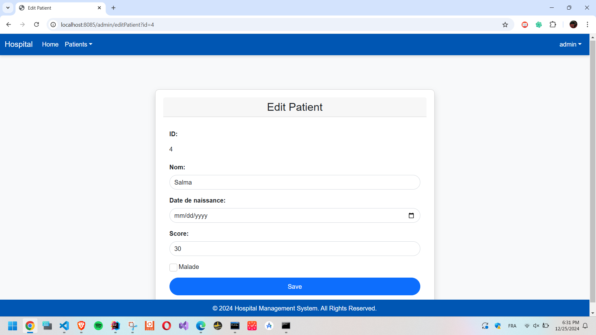

# Hospital Management Application

## Overview
The **Hospital Management Application** is a basic Java Spring Boot web application designed to manage patients' information. It allows users to:
- List patients with pagination.
- Search patients by name.
- Add, edit, and delete patient records.

The application is developed using the following technologies:

- **Backend**: Spring Boot, JPA (Hibernate), Java 17
- **Frontend**: Thymeleaf, Bootstrap
- **Database**: MySQL
- **Build Tool**: Maven

---

## Features

1. **Patient Management**
    - View the list of patients.
    - Add new patients.
    - Edit patient details.
    - Delete a patient record.

2. **Search and Pagination**
    - Search patients by keyword.
    - Navigate through patient records using pagination.

3. **Security (Authentication & Authorization)**
    - Secured login functionality using Spring Security. 
    - Role-based access control:
       - Admin: Full access to all CRUD operations. 
       - User: Read-only access to patient information.

4. **Real-Time View Updates**
    - Automatically updates the table when new records are added or deleted.

---

## Technologies Used
  - **Backend:** Spring Boot, Spring Security, JPA (Hibernate), Java 17
  - **Frontend:** Thymeleaf, Bootstrap, CSS
  - **Database:** MySQL
  - **Build Tool:** Maven


## Project Structure

```
├── src
│   ├── main
│   │   ├── java
│   │   │   └── net.yassine.hospitalapp
│   │   │       ├── entities
│   │   │       │   └── Patient.java            # Represents the Patient entity
│   │   │       ├── repository
│   │   │       │   └── PatientRepository.java   # Repository interface for database operations
│   │   │       ├── web
│   │   │       │   ├── PatientController.java   # Handles HTTP requests for patient-related operations
│   │   │       │   └── LoginController.java     # New controller for handling login requests
│   │   │       ├── security
│   │   │       │   └── SecurityConfig.java      # Security configuration class
│   │   │       └── UnsecuredHospitalAppSpringBoot.java  # Main Spring Boot application entry point
│   │   └── resources
│   │       ├── templates
│   │       │   ├── patients.html               # View for displaying the list of patients
│   │       │   ├── formPatient.html            # Form for adding a new patient
│   │       │   ├── editPatient.html           # Form for editing existing patient data
│   │       │   └── login.html                 # Login page template
│   │       └── application.properties         # Spring Boot application configuration
├── pom.xml                                      # Maven build configuration
└── README.md                                    # Project documentation and instructions
                                   

```

---

## Setup Instructions

### Prerequisites
Ensure you have the following installed:
- **Java**: JDK 17 or later
- **Maven**: Version 3.6 or later
- **IDE**: IntelliJ IDEA, Eclipse, or any Java IDE

### Steps to Run
1. Clone the repository:
   ```bash
   git clone https://github.com/yassineab53/UnsecuredHospitalApp-SpringBoot
   cd unsecured-hospital-app
   ```
2. Build the project:
   ```bash
   mvn clean install
   ```
3. Run the application:
   ```bash
   mvn spring-boot:run
   ```
4. Open the application in your browser:
   ```
   http://localhost:8085/index
   ```

---

## Screenshots
### 1. Login page


### 2. List of Patients


### 3. Add a Patient


### 4. Edit Patient




## Database Configuration
The configuration can be found in the `application.properties` file.<br>
For H2 memory database : 

```properties
spring.datasource.url=jdbc:h2:mem:testdb
spring.datasource.driverClassName=org.h2.Driver
spring.datasource.username=sa
spring.datasource.password=
spring.h2.console.enabled=true
spring.jpa.database-platform=org.hibernate.dialect.H2Dialect

```
For MySQL database :
```properties
server.port=8085

spring.datasource.url=jdbc:mysql://localhost:3306/hospital-db?createDatabaseIfNotExist=true
spring.datasource.username=root
spring.datasource.password=root
spring.jpa.hibernate.ddl-auto=update
spring.jpa.properties.hibernate.dialect=org.hibernate.dialect.MySQLDialect
spring.mvc.format.date=yyyy-MM-dd
spring.thymeleaf.cache=false
spring.jpa.show-sql=true

```

---

## Future Improvements

- **Security**: Add Spring Security to secure endpoints and sensitive data : done
- **Advanced Features**: Implement role-based access control (e.g., admin vs user functionality) : done
- **Database Integration**: Replace H2 with a production-ready database like MySQL : done
- **Testing**: Add unit and integration tests using JUnit and Mockito.

---

## Author
**Abbou Yassine** : yassine.abbou.23@ump.ac.ma
--
